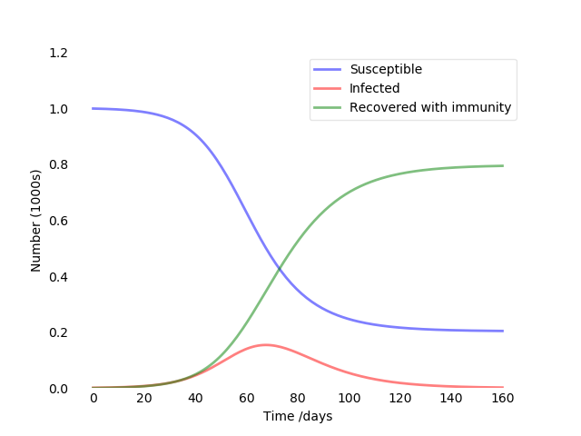

# Naive Compartmental COVID-19 model
Toy compartmental model of novel coronavirus, do not use for any serious purpose. 
Initial code is based on this [book chapter](https://scipython.com/book/chapter-8-scipy/additional-examples/the-sir-epidemic-model/).

- For a very basic introduction, see [Wikipedia](https://en.wikipedia.org/wiki/Compartmental_models_in_epidemiology).

- To do quick experiments with different parameters, look at this [ASU tool](http://www.public.asu.edu/~hnesse/classes/sir.html).

Mostly, this model is meant to alleviate some panic and also to explore compartmental modeling.

## Model Details

This will be filled in as I work on the model (if I chose to extend it more..)

## Results

